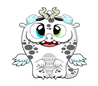

# Awesome CryptoCollectibles (& CryptoAssets)

A collection about Awesome Crypto Collectibles - Yes, Non Fungible Tokens (NFTs) - Yes, Unique Bits & Bytes on the Blockchain - Buy! Sell! Hodl!


## Non fungible tokens (NFTs)

_Trade (unique) collectibles on the blockchain_

Non fungible tokens (NFTs) represent ownership 
over digital or physical assets. Examples:

- Physical property -- houses, unique artwork
- Virtual collectibles -- unique pictures of kittens, collectible cards
- "Negative value" assets -- loans, burdens and other responsibilities


In general, all houses are distinct and no two kitties are alike. Non fungible tokens (NFTs) are 
*distinguishable* and must track the ownership of each one separately.


### Assets, Assets, Assets - Deeds, Deeds, Deeds - Titles, Titles, Titles

Synonyms for non fungible tokens (NFTs) in the "universe of distinguishable digital assets" include:

- deed   (descriptive for certain applications, notably, physical property).
- asset
- title
- token
- equity
- ticket


### Ethereum Request for Comments (ERC) #721

#### Unique Identifiers / IDs

Every non fungible token (NFT) is identified by a unique `uint256` ID inside the contract e.g.

``` solidity
/// @dev An array containing the Kitty struct for all Kitties in existence. The ID
///  of each cat is actually an index into this array. Note that ID 0 is a negacat,
///  the unKitty, the mythical beast that is the parent of all gen0 cats. A bizarre
///  creature that is both matron and sire... to itself! Has an invalid genetic code.
///  In other words, cat ID 0 is invalid... ;-)

Kitty[] kitties;
```

The number SHALL NOT change for the life of the contract. 
The pair (contract address, `uint256` tokenId) will then be a globally unique and fully-qualified identifier 
for a specific asset on the ethereum blockchain. 

Note: While some contracts may find it convenient to start with ID 0 and simply add one for each new token, callers SHALL NOT assume that ID numbers have any specific pattern,  and MUST treat the ID as a "black box". The choice of uint256 allows a wide variety of applications because UUIDs and SHA3 hashes are directly convertible to `uint256`.


#### Version 1 / V1 

Ethereum Request for Comments (ERCs)

- [ERC #721 Non fungible token standard](https://github.com/ethereum/EIPs/blob/master/EIPS/eip-721.md), Ethereum Improvement Proposals (EIPs) page started in Jan 2018


ERC #721 Contract / Service

``` solidity
interface ERC721  {
    // Required methods
    function balanceOf(address _owner) external view returns (uint256);
    function ownerOf(uint256 _tokenId) external view returns (address);
    function safeTransferFrom(address _from, address _to, uint256 _tokenId, bytes data) external payable;
    function safeTransferFrom(address _from, address _to, uint256 _tokenId) external payable;
    function transferFrom(address _from, address _to, uint256 _tokenId) external payable;
    function approve(address _approved, uint256 _tokenId) external payable;
    function setApprovalForAll(address _operator, bool _approved) external;
    function getApproved(uint256 _tokenId) external view returns (address);
    function isApprovedForAll(address _owner, address _operator) external view returns (bool);
    
    // Events
    event Transfer(address indexed _from, address indexed _to, uint256 _tokenId);
    event Approval(address indexed _owner, address indexed _approved, uint256 _tokenId);
    event ApprovalForAll(address indexed _owner, address indexed _operator, bool _approved);    
}

interface ERC721TokenReceiver {
    /// @notice Handle the receipt of an NFT
    function onERC721Received(address _from, uint256 _tokenId, bytes data) external returns(bytes4);
}


/// @title optional metadata extension
interface ERC721Metadata /* is ERC721 */ {
    function name() external pure returns (string _name);
    function symbol() external pure returns (string _symbol);
    function tokenURI(uint256 _tokenId) external view returns (string);
}


/// @title optional enumeration extension
interface ERC721Enumerable  {
    function totalSupply() external view returns (uint256);
    function tokenByIndex(uint256 _index) external view returns (uint256);
    function tokenOfOwnerByIndex(address _owner, uint256 _index) external view returns (uint256);
}
```

(Source: [`contracts/ERC721-V0.sol`](contracts/ERC721-V1.sol))


#### Version 0 / V0

Ethereum Request for Comments (ERCs)

- [ERC #721 Non fungible token standard)](https://github.com/ethereum/EIPs/issues/721), issue ticket opened in Sept 2017

ERC #721 Contract / Service

``` solidity
// Required methods
function totalSupply() public view returns (uint256 total);
function balanceOf(address _owner) public view returns (uint256 balance);
function ownerOf(uint256 _tokenId) external view returns (address owner);
function approve(address _to, uint256 _tokenId) external;
function transfer(address _to, uint256 _tokenId) external;
function transferFrom(address _from, address _to, uint256 _tokenId) external;

// Events
event Transfer(address from, address to, uint256 tokenId);
event Approval(address owner, address approved, uint256 tokenId);

// Optional
function name() public view returns (string name);
function symbol() public view returns (string symbol);
function tokensOfOwner(address _owner) external view returns (uint256[] tokenIds);
function tokenMetadata(uint256 _tokenId, string _preferredTransport) public view returns (string infoUrl);
```

(Source: [`contracts/ERC721-V0.sol`](contracts/ERC721-V0.sol))


#### Documentation

ERC #721 Info Website (web: [erc721.org](http://erc721.org))


<!--

#### Ethereum Request for Comments (ERC)s

- [ERC #875 Non fungible tokens and simple atomic swaps](https://github.com/ethereum/EIPs/issues/875), Feb 2018

-->


#### Articles

- [The Anatomy of ERC721 - Understanding Non Fungible Tokens (NFTs) on Ethereum](https://medium.com/crypto-currently/the-anatomy-of-erc721-e9db77abfc24)
by Gerald Nash, Howard University '21, Dec 2017


#### Trade ERC #721 Tokens

- **OpenSea** (web: [opensea.io](https://opensea.io)) - Buy, sell, and discover digital items
- **RareBits** (web: [rarebits.io](https://rarebits.io)) - Buy, sell, and discover unique crypto assets


## Do-It-Yourself (DIY)

_Build your own crypto collectibles (from scratch)_

### CryptoZombies

A free, interactive code school that teaches you to build crypto collectible games on the ethereum blockchain.

> Build a Zombie Army. In Lesson 1, you will build a Zombie Factory to build your army. 
> Every Zombie you create will have randomly generated DNA and have his own unique appearance.
> Further lessons (1 released each week) will add more functionality to your game, 
> like the ability to battle other people's zombies! 

Learn more @ [cryptozombies.io](https://cryptozombies.io)


## Collectibles 

### Buyer Beware - Here Be Dragons! - Buyer Beware

#### Q: Are crypto collectible "games" online gambling casinos?

Gambling vs Investing

> Investments are generally not considered gambling when they meet the following criteria:
>
> - Economic utility
> - Positive expected returns (at least in the long term)
> - Underlying value independent of the risk being undertaken
>
> -- [What's Gambling @ Wikipedia](https://en.wikipedia.org/wiki/Gambling)

For example, the mixing of genes when breeding (siring) new kitties is a modern
"masqueraded" or fun way to roll a dice or spin a roulette wheel.
The betting (wagering) on rare traits is a modern "masqueraded" or fun
way of betting (wagering) on lucky numbers.

And, of course, the kitties are a modern "masqueraded" or fun way of casino "funny money" tokens
rebranded as digital "virtual" cat collectibles or
non fungible tokens (NFTs).

**BEWARE: Gambling is fun and addictive. Winning and losing. Up and down.
Treat CryptoKittes (and CryptoCollectibles) as entertainment like casino gambling, sports betting or poker cards playing.
Do NOT "invest" trying to get-rich-quick
or raise the stakes trying to win back what you have lost, and so on.**


#### Q: What about scams?

**BEWARE: Yes, most crypto collectible "games" are money-grabbing get-rich-quick rip-off schemes. 
"Classic" scam examples include CryptoCelebrities, CryptoCountries, CryptoCities, Own A Number, EtherTulips and many more.**


### CryptoKitties (Yes, Cute Little Cartoon Cats) on the Blockchain!

Collectible. Breedable. Adorable. Collect and breed digital cats. The future is meow.

See the [Awesome CryptoKitties (& CryptoCopycats)](https://github.com/openblockchains/awesome-cryptokitties) page »


### CrytoDrakos (Yes, Cute Litte Cartoon Dragons) on the Blockchain! (Upcoming)

Collectible. Breedable. Admirable. Unbeatable.

Learn more @ [cryptodrakos.co](https://cryptodrakos.co), twitter: [CryptoDrakos](https://twitter.com/CryptoDrakos)




### CryptoPuppies (Yes, Cute Little Cartoon Dogs) on the Blockchain! (Upcoming)

Collectable. Breedable. Adorable.


Learn more @ [cryptopuppies.org](http://cryptopuppies.org), twitter: [CryptoPuppies_](https://twitter.com/CryptoPuppies_)

---


Learn more @ twitter: [Crypto_Puppies](https://twitter.com/Crypto_Puppies)


### Puppy Planet on the Blockchain! (Upcoming)

Buy, sell, hodl and breed puppies.


Learn more @ [puppyplanet.co](http://www.puppyplanet.co),
twitter: [aPuppyPlanet](https://twitter.com/aPuppyPlanet)


### HashPuppies on the Blockchain! (Upcoming)

> We want to have a presale first so we can raise funds to hire more devs and artists
> and pay for scalable infrastructure,
> to have a really great and responsive game.
> We are working out the legal aspects of the presale right now,
> because there is a lot of uncertainty right now around crowdfunding with cryptocurrency.


Learn more @ [hashpuppi.es](https://hashpuppi.es),
twitter: [hash_puppies](https://twitter.com/hash_puppies),
reddit: [HashPuppies](https://www.reddit.com/r/HashPuppies)


### CryptoPets on the Blockchain!  (Upcoming)

The first five animals to be sold off...
Please welcome the Dog, Galapagos Turtle, Giant Panda, T-Rex  and Unicorn  
as the founding species on CryptoPets!

> CryptoPets are the newest breed of animals on the block... blockchain that is.
> Unlike cryptocurrencies, which require all tokens to be identical,
> your CryptoPet will be the only one of its kind in the entire world.
> These cute collectibles are cryptographically unique, non-fungible digital assets.
> CryptoPets uses the immutability of blockchain technology to verify and prove that each CryptoPet
> has its own special attributes and is entirely owned by you.  
> Each species will have variations in specific attributes,
> including fur color, eye shape, paw, and feet type, to name a few.


Learn more @ [cryptopets.co](https://cryptopets.co),
twitter: [CryptoPets](https://twitter.com/CryptoPets),
reddit: [CryptoPets](https://www.reddit.com/r/CryptoPets)


### CryptoMons(ters) on the Blockchain! (Upcoming)

Collect. Combat. Trade. Digital collectible (monster) cards on the blockchain.

> Every CryptoMons(ter) has his own DNA that defines his aspect and stats:
> there are no two identical CryptoMons(ter).


Learn more @ [cryptomons.com](http://cryptomons.com),
twitter: [cryptomons](https://twitter.com/cryptomons)


## CryptoDrome (CryptoHorses) on the Blockchain! (Upcoming)

Collect. Breed. Compete. Raise your own champions.

> We're CryptoHorses, and we were born to compete. Collect and become a champion of the CryptoDrome.


Learn more @ [cryptodrome.co](http://cryptodrome.co),
twitter: [cryptodrome](https://twitter.com/cryptodrome)

Team:

- **Miguel Ángel Fort** (twitter: [@mafp86](https://twitter.com/mafp86))


### CryptoFighters on the Blockchain! (Upcoming)

Collectible fighters. Level up and start battling.

Learn more @ [cryptofighters.io](http://cryptofighters.io),
twitter: [CryptoFighters](https://twitter.com/CryptoFighters)


### Fishbank / CryptoFish on the Blockchain! (Upcoming)

Grow your fish to the top of food chain!

> Take your place in a decentralized food chain.
> Grow, fight and trade your predatory fish champion
> on the blockchain!
>
> Hunt other fishes and bite off their weight to take top positions in global leaderboards
> of decentralized deep blue ocean. Trade your winner fish to a better one and grow another champion!


Learn more @ [fishbank.io](https://fishbank.io)

> New Year gift for all the crypto cuties!
> Every owner of Gen 0 asset in any other crypto  pets collectible as of 1th Jan. 2018
> may request a special gift - the Rare fish token in Fishbank.
> That is what can be generally referred to as "hardfork effect" in blockchain ecosystems.

Team:

- Chat Robotic @ [chatrobotic.com](http://www.chatrobotic.com), twitter: [chatrobotic](https://twitter.com/chatrobotic)


White Paper V1  ([PDF Download](https://fishbank.io/whitepaper/FISHBANK-V1.pdf)):

**Game concept**

Player owns fishes (those are in fact ERC-721 crypto tokens) each with its unique name, image and
characteristics defined by type. Core fish parameter is weight that defines its size and influence. Main
target is to grow this parameter to become the biggest fish in the ocean.
Fish is able to gain weight only by attacking other fishes, biting off them in case of win.

The more powerful characteristics and the more weight the fish has the
more chance it to win a fight with another fish it represents.

These fishes can be traded or exchanged between players on central fish market.
Every operation in the game is launched and controlled by a contract script.

**The Fish**

Every crypto fish token has its own set of characteristics:

- Weight - Describes the size of the fish
- Power - Damage on attack
- Agility - Defense on attack
- Speed - Cooldown time before attacks

Weight is dynamic characteristic and can be changed within time while Power, Agility and
Speed are called initial parameters those are given to fish from the very moment of creation
and can't be changed in time.

**Rarity**

There are four kinds of rarity assessment  for fishes determined by sum of all
initial fish characteristics:

- Common
- Rare (10+)
- Legendary (15+)
- Epic (25+)


### CryptoTulips on the Blockchain!  (Upcoming)

Learn by Example from the Real World (Anno 1637) - Buy! Sell! Hold!
Enjoy the Beauty of Admiral of Admirals, Semper Augustus and More.


Learn more @ [openblockchains/tulips](https://github.com/openblockchains/tulips)


### More

<!-- add decentraland ??   virtual land (parcels) on the blockchain and more -->


### News & Updates

**CryptoGames on the Blockchain! News**

See web: [cryptogamer.net](http://www.cryptogamer.net), twitter: [CryptoGamerNet](https://twitter.com/CryptoGamerNet)


**Crypto Blockchain Games List**

See the reddit for an [up-to-date crypto blockchain games list](https://www.reddit.com/r/BlockchainGame/comments/7oi21o/daily_updated_table_list_of_blockchain_based_games/), 
reddit: [BlockchainGame](https://www.reddit.com/r/BlockchainGame)
incl. Etheremon, Pandarium, SubPrime Crypto, EtherRock, Tron Dogs, Own A Number, CryptoBots, CryptoAlpaca, EtherLambos, CryptoArts
and many more.


**Ethereum Crypto Games by Transaction Volume**

See the ethereum distributed app tracker, web: [dapptrack.com](https://dapptrack.com).


## Awesome Awesomeness

- [Awesome Non Fungible Tokens (NFTs)](https://github.com/buendiadas/awesome-nonfungibletokens) - an awesome curated list of resources regarding implementations of Non Fungible Tokens (ERC721 standard).
- [Awesome Blockchains](https://github.com/openblockchains/awesome-blockchains) - a collection about awesome blockchains - open distributed public databases w/ crypto hashes incl. git ;-). Blockchains are the new tulips. Distributed is the new centralized.


## Meta

**License**


The awesome list is dedicated to the public domain. Use it as you please with no restrictions whatsoever.
